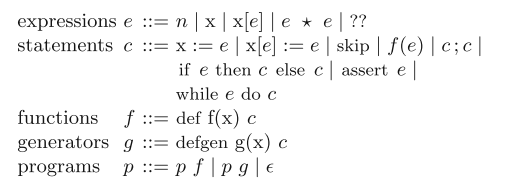
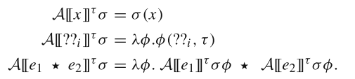
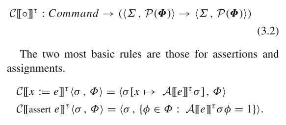
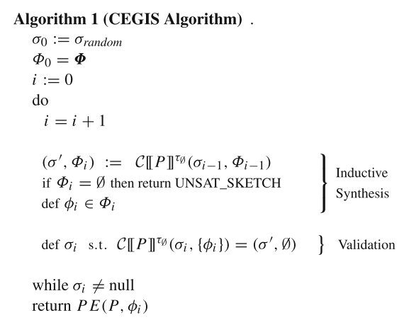

# Sketch

**Program Sketching**

STTT'13

Keywords: SAT/SMT applications, Constraint-based synthesis, Sketching, Synthesis

Frontend: https://bitbucket.org/gatoatigrado/sketch-frontend/src/default/

Backend: https://bitbucket.org/gatoatigrado/sketch-backend/commits/

实质：利用符号执行合成程序

## Basic Notation

- $L$: the set of variables in the program. $x$ is used to refer to an arbitrary variable.

- $H$: the set of holes in the program. All holes are assumed to be uniquely labeled.
- $T$: the set of calling contexts.
- $\mathbb{\Phi} = H \times T \rightarrow \mathbb{Z}$: the set of control functions.
- $P(\mathbb{\Phi})$: the powerset of $\mathbb{\Phi}$.
- $\Psi = \mathbb{\Phi} \rightarrow \mathbb{Z}$: the set of parameterized values. A parameterized value produces an integer for each control.
- $\Sigma = L \rightarrow \Psi$:  the set of all states. A state $\sigma$ maps each variable to a parameterized value.

## Denotational Semantics

## Synthesis Algorithm

