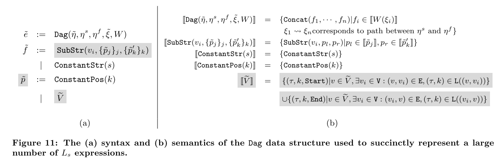

# BlinkFill

**BlinkFill: Semi-supervised Programming By Example for Syntactic String Transformation**

VLDB'18

Keywords: Semi-Supervised Learning, Programming By Example, String Transformation

## Feature

- String transformation
  - just like FlashFill
- Semi-supervised learning
  - use not only examples, but also input tasks

## Preliminaries

### Base Regular Expression (Token)

- ProperCase: `[A-Z][a-z]+`
- CAPS: `[​A-Z​]+`
- lowercase: `[a-z]+`
- Digits: `[0-9]+`
- Alphabets: `[A-Za-z]+`
- Whitespace
- StartT: `^`
- EndT: `$`
-  ...

### Token Match (Atomic Expression)

A token match `(t, k)` means the k-th match of base regex `t`. (k can be negative)

## Input Data Graph

### Cartesian Product

Basically, it is the Cartesian product of `InputDataGraph`s.

## String Transformation

### String Transformation Language

### DAG Structure

## Ranking Strategy

Prefer token sequences with more contexts around them as they are more likely to correspond to the desired transformation logic.

Then find a path with maximum score by an efficient modification of Dijkstra's shortest path algorithm.

### Alternatives

- Occam's razor principle;
- Learning a a ranking function over features of the expressions.

## Problems (from CSE291 Reading List)

Q: What does BlinkFill use as behavioral constraints? Structural constraints? Search strategy?

A: Behavioral constraints & structure constraints: DAG structures;
Search strategy: the more contexts, the better;

Q: What is the main technical insight of BlinkFill wrt FlashFill?

A: **Semi-supervised learning**
It uses not only input-output examples, but also input data without respective outputs. These data can be used to prune out invalid expressions.

Q: Write a program in the BlinkFill DSL (`L_s`) that extracts conference acronyms and years; the program should satisfy the following examples:

- "Programming Language Design and Implementation (PLDI), 2019, Phoenix AZ" -> "PLDI 2019"
- "Principles of Programming Languages (POPL), 2020, New Orleans LA" -> "POPL 2020",

A: `Substr(Pos(' (', 1, end), Pos(') ', 1 start)) + Constant(' ') +Substr(Pos(', ', 1, end), Pos(', ', 2, start)) `

Q: As described in the paper, the position expressions of the BlinkFill DSL only support matching a single token from Table 1, e.g. `C`. Could we extend the algorithm to support sequences of tokens, e.g. `C ws $` to match caps followed by whitespace follows by end of string? How would this change the construction and intersection of input data graphs (use Fig 6 as an example).

A: Just create a new DAG where every edge from `u` to `v` consists of all paths in the original DAG from `u` to `v`. The remaining things are the same.